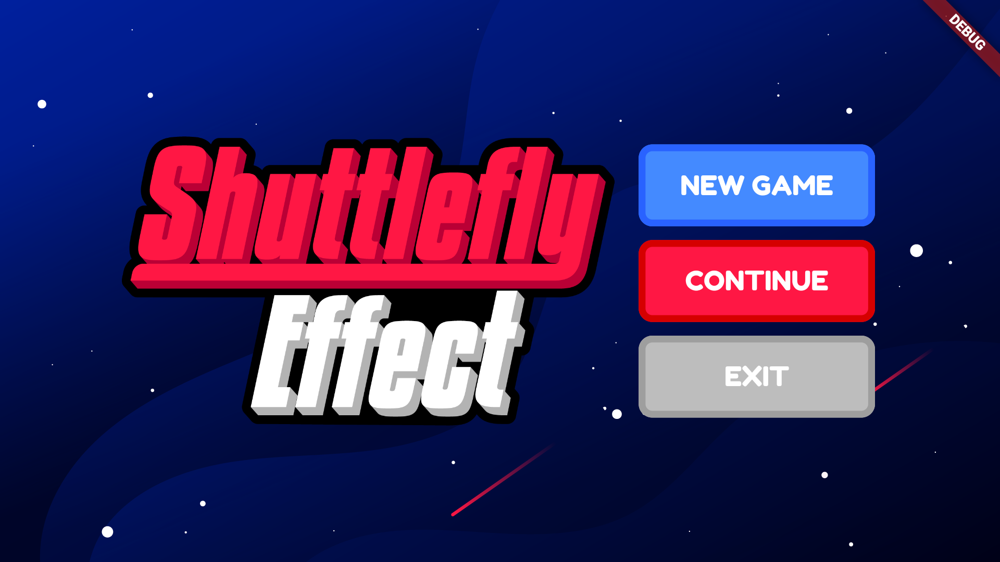
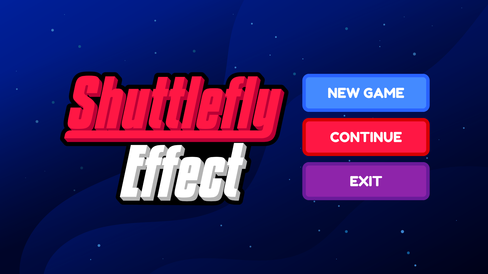

# Shuttlefly Effect

The project was started as Yildiz Technical University Computer Engineering Midterm Project. The basic idea was to create a game that the player can create its own story.

Started the first version with the collaboration of [Kübra Tunç](https://github.com/kubratunc). Right now, first version is terminated and second version is a under-development hobby game.

## About The Game

This game is a storytelling space game. It is being developed with Flutter. The story starts with a shuttle accident in space, the goal is to make astronauts find a way to go back to planet Earth.

The player should select 3 astronauts to control the situation from start. Each astronaut will have its own profession. During game, the player should select an astronaut to solve a problem (an event). Each astronaut with a unique profession will affect the states (health, morale, oxygen, source) differently. The player should find a balance between these states. If any state hits zero, the game ends.

Mostly inspired from Reigns (a mobile decision game).

## Snapshots

| V1 | V2 |
| --- | --- |
|  |  |
